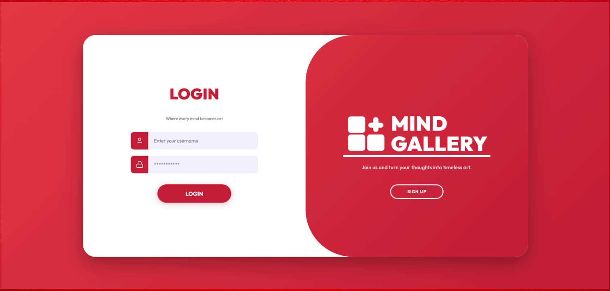
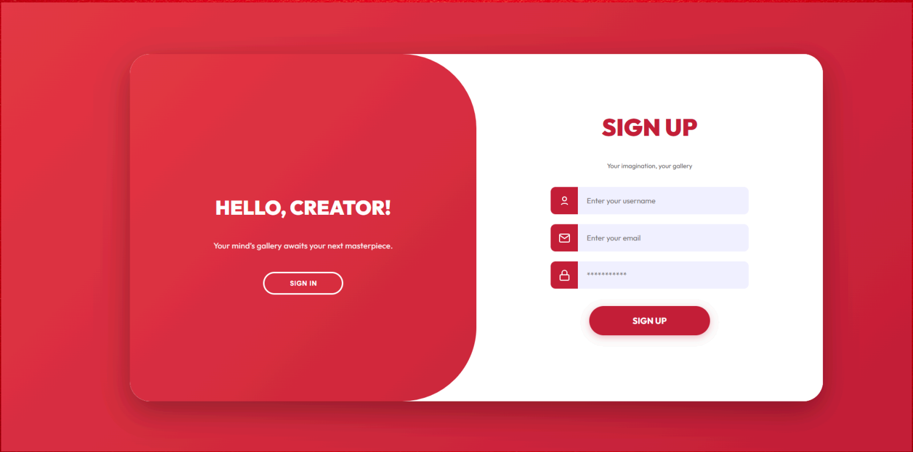
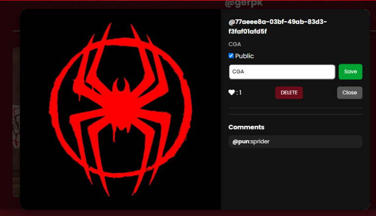
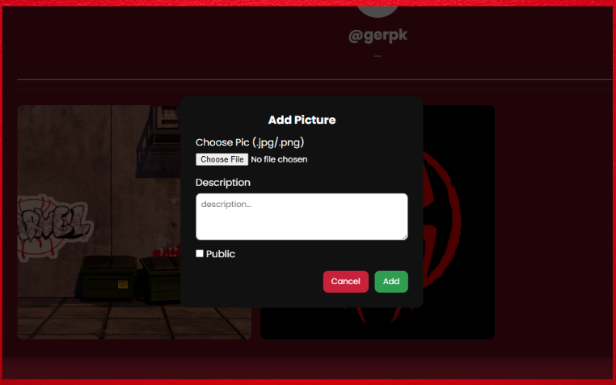
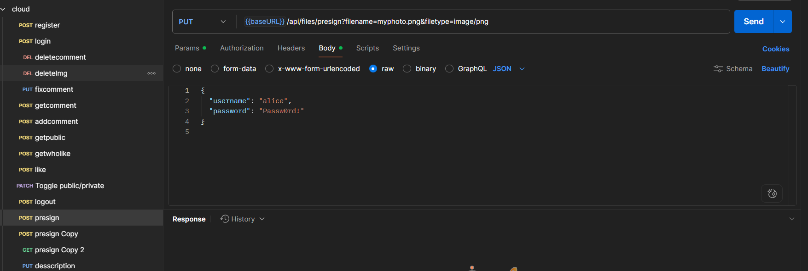

#  Mind Gallery

Mind Gallery คือเว็ปแพลตฟอร์มสร้างขึ้นเพื่อแก้ปัญหาการจัดเก็บและเผยแพร่ผลงาน
รูปภาพ โปรเจคนี้ช่วยให้ผู้ใช้สามารถอัปโหลดรูปภาพพร้อมกำหนดความเป็นส่วนตัว และสามารถชื่นชมผลงานต่างๆที่ผู้ใช้อื่นได้อัปโหลด และสามารถกดชื่นชอบรวมไปถึงแสดงความคิดเห็นต่อผลงานของกันและกันได้อย่างง่ายดาย เป็นการเปลี่ยนการจัดเก็บไฟล์แบบเดิมๆ ให้เป็นโอกาสในการแบ่งปันและสร้างสรรค์ผลงานต่างๆ

รันการทำงานฝั่งเซิร์ฟเวอร์ด้วย Node.js + Express + EJS และเก็บข้อมูลใน MongoDB

# Mind Gallery Preview
### ตัวอย่างหน้าจอการใช้งาน (Screenshots)

### หน้า Login 


### หน้า Register 


### หน้าหลัก






## ✨ Features
- **Authentication:** ระบบ Login/Register รักษาความปลอดภัยด้วย JWT (`JWT_SECRET`)
- **Gallery Visibility:** ผู้ใช้สามารถตั้งค่ารูปภาพเป็น Public (สาธารณะ) หรือ Private (ส่วนตัว) ได้
- **Interactions:** ระบบ Like และ Comment (อนุญาตให้แก้ไข/ลบได้เฉพาะเจ้าของคอมเมนต์หรือรูปภาพเท่านั้น)
- **SSR (Server-Side Rendering):** แสดงผลหน้าเว็บด้วย EJS 

## 🧰 Tech Stack
- **Server:** Node.js, Express.js, EJS
- **Database:** MongoDB (Mongoose)
- **Testing:** Jest

## 🚀 เริ่มต้นใช้งาน (Getting Started)

### 1. ติดตั้ง Dependencies
```bash
npm install
```

### 2. ตั้งค่า Environment Variables
```bash
ทำการคัดลอกไฟล์ .env.example แล้วเปลี่ยนชื่อเป็น .env

แก้ไขค่าคอนฟิกต่างๆ ในไฟล์ .env (เช่น DB_URL, JWT_SECRET)

ตัวอย่างไฟล์ .env:

ข้อมูลโค้ด
DB_URL=mongodb://localhost:27017/mind_gallery
JWT_SECRET=your_super_secret_key
```
### 3. รันเซิร์ฟเวอร์
```bash
node server.js
```

### 4. รันเทสต์ (Automated Testing)
```bash
npm test
```
## 📡 API Testing (Postman)

โปรเจคนี้ได้จัดเตรียม API Documentation และ Collection ไว้สำหรับการทดสอบเรียบร้อยแล้ว โดยครอบคลุมระบบการทำงานหลักทั้งหมด (User, Gallery, Comment และ Like) s



### Postman Documentation 

สามารถดูรายละเอียดของ Endpoint ต่างๆ รวมถึงรูปแบบ Request และตัวอย่าง Response 

 **[Mind Gallery API Documentation](https://documenter.getpostman.com/view/47036038/2sBXiomqCT)**


### Import ไฟล์ Collection สำหรับทดสอบในเครื่อง
หากต้องการทดสอบยิง API ด้วยตัวเองผ่าน Localhost สามารถทำตามขั้นตอนต่อไปนี้:
[Mind Gallery API.postman_collection.json](./postman/Mind%20Gallery%20API.postman_collection.json)
```bash
1. ไปที่โฟลเดอร์ `postman/` ภายในโปรเจคนี้
```
```bash
2. นำไฟล์ `Mind Gallery API.postman_collection.json` ไป Import ลงในโปรแกรม Postman ของคุณ
```
```bash
3. เริ่มต้นทดสอบ API ต่างๆ ในระบบได้ทันที
```
